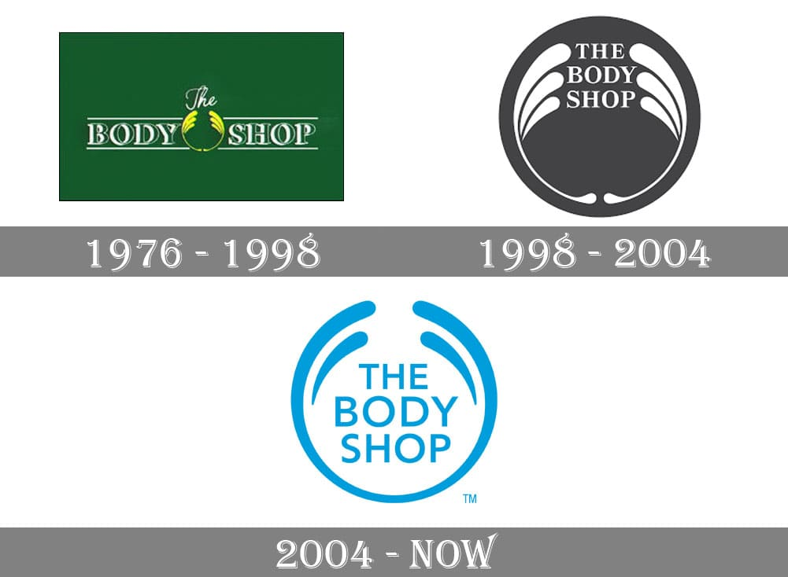

The Body Shop was founded in 1976 by Dame Anita Roddick, starting out as only a little green painted shop in Brighton. The idea behind this little haven of ethically sourced and natural products was to help women believe in their natural beauty, a concept which the branding of The Body Shop reflects in both typography and image.

In the words of Roddick herself; 

> "Beauty is an outward expression of everything you like about yourself" 

This statement is emulated in the way that the brand has been depicted. 

Since 1976, The Body Shop has had three logo 'makeovers' as it transitioned from a small high street shop to a more commercialised company. These transformations have changed both the design and the type face of the logo drastically over the years, as the brand began to mirror the ideas that it projects. 

In particular, the attitude that the brand has to the way that women and girls 'should look' is represented by the more modern typeface that was used from 2004. Anita Roddick believed that beauty was 'a persons source of joy, comfort and self esteem' \[1^] and therefore expected her products to be used in a way that reflected a 'daily ritual of self love' instead of false promises of anti-ageing and abnormal slimming; which the industry pedalled in the 1970s. 

The typeface used in 2004 is very low contrast with regulated cap heights and entirely capitalised. This simplistic choice of font represents the inclusivity that the brand wants the customer to feel, while it could also be interpreted as the female body-- the common denominator for beauty on the outside while it is also the courier for beauty on the inside. The brand was designed to empower women and girls, therefore the typeface representing this is a powerful statement. 

Origionally, the body shop used a typeface that was that was ornate, with serifs and had 3D elements to it that formed a bold shadow effect. This could have been to ensure that the shops name really stood out while complying with the standard "boutique" effect that would have enticed the clientele at the time. The nature of the typeface is particularly organic, such like the brand itself-- considering that The Body Shop was one of the first cosmetic brands to prohibit testing on animals and introduce FairTrade to the beauty industry \[2^]. Contrasting to the more modern versions of the logo of 1998 and 2004 which had a more digital feeling, in keeping with the modern day and introduction of technology over the years. 

\[1^] https://www.thebodyshop.com/en-gb/about-us/our-story/a/a00002

\[2^] <https://www.theguardian.com/fashion/fashion-blog/2011/nov/21/brief-history-of-body-shop>