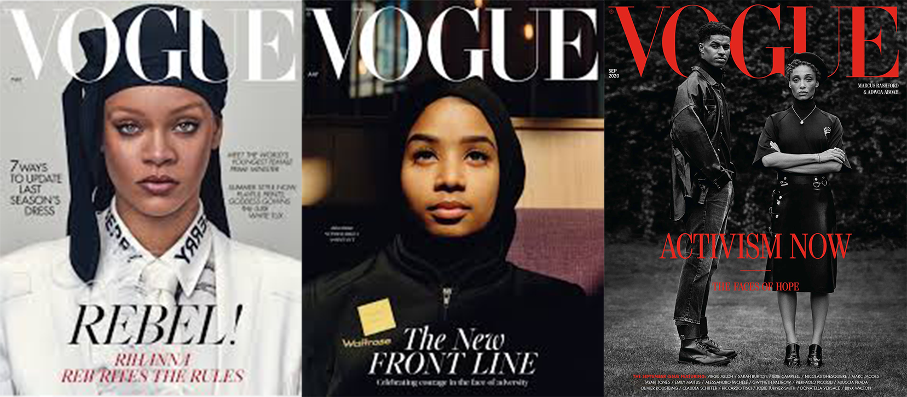

*With Vogue's ever growing, ever changing community, how can they afford to keep a logo which hasn't been changed for decades?* 

As a fashion and beauty orientated magazine, often referred to as "the fashion bible", Vogue has always been one step ahead of the trends and a highly respected publication. With this in mind, the task that Vogue has been set as an iconic fashion magazine does not merely relate to reporting the new fads, phases and fashions. They also have to incorporate the changes in society by choosing brands and designers that reflect this, in every issue. Hence forth, this called into question their logo which has withstood the test of time, despite the changes in the industry which vogue showcases. 

 When Vogue was first published in the 1890s, the logos were hand lettered for every issue by an illustrator so as to represent the themes of the issue that was published. A similar idea was used when Conde Nast took over the magazine in the early 1900's, where each cover logo was more colourful and theatrical yet still personal to the issue-- this represented the Art Deco/ Jazz age. It was only in the 1940's that Vogue adopted the first version of its iconic typeface; Didot. However they were still deliberating between the use of Serif to Sans Serif. Since the 1950's, Vogue has chosen an all upper case, Didot typeface as their permanent logo. The font itself was named for the brothers Pierre and Firmin Dido who were highly regarded publishers, printers and typeface designers, and the current covers still use this type face or a custom version named "Vogue AG" which is very avant garde/ gothic.

This choice of typeface resonates with Vogue's iconic status, not only because of the history of the Didot font; depicting its elegance and credibility, but the fact that they have kept this logo for the past 70 years. As a consumer audience, we are drawn to the way that vogue has looked this way with their choice of typography for so long, as it has become memorable and we trust in its integrity. In essence, Vogue has become an everlasting, timeless necessity in the evolution of fashion and i believe their poignant typeface has played a part in this. 

The word 'Vogue' is defined as "the prevailing fashion or style at a particular time" which gives the impression that as the magazine shares this name, they are always very current and for want of a better word; Vogue.