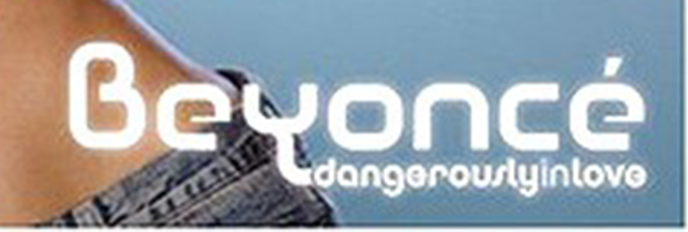
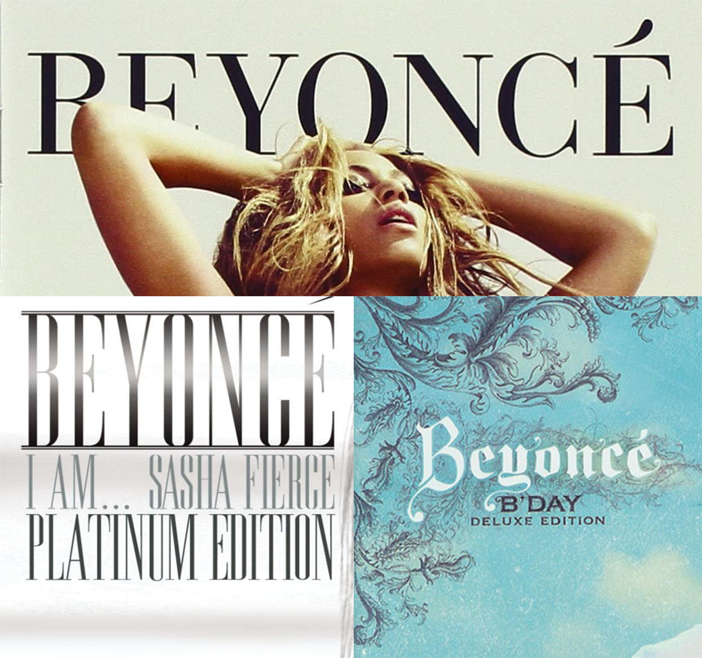
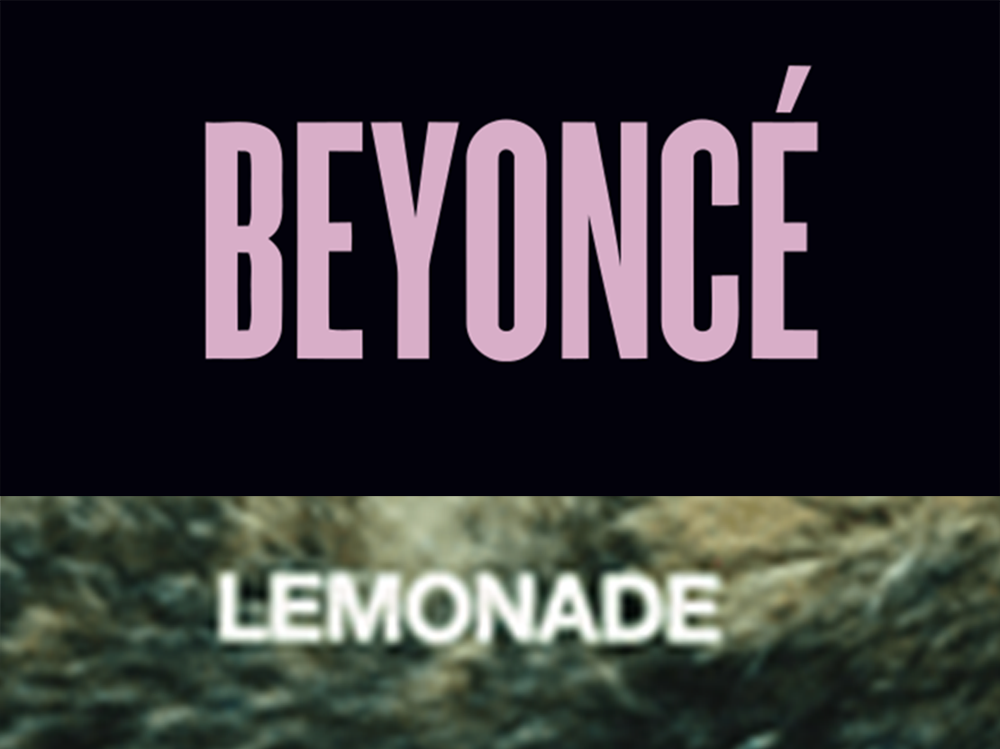

Beyoncé has always used powerful imagery to convey her strong feminist, cultural messages. Having recently released her Netflix documentary 'Mrs. Carter's cultural evolution aka "Homecoming: A Film by Beyoncé', she is no stranger to using the art of typography to engage an audience and create a powerful feminist movement- for women alike. 

To demonstrate some of Queen Bey's sassy, empowered flare, i turned to her discography and the way that she uses the style of her album covers to speak to the crowds:

In 2003, Bey's debut album following the disbanding of Destiny's child, Dangerously in Love was the first album that she released. The album cover had a particularly naughties feel with its digital graffics; a hint towards the turning of the century. 

The choice of font resembles Churchward Design font by BluHead studio, it is a cartoon like font which could be seen as a very youthful, fun choice. In 2003, Beyonce at 22 would have been in her own roaring 20s, therefore the choice of font embraced her girlish charm but also her transition into being a woman. To all of the young girls who adored Bey at the time, the text appealed to both a young audience who admired her, while their older counter parts enjoyed the vibrance and energy that this album incited.

Her second, third and fourth albums, which ironically the fourth was named '4', were defined by their much more elaborate typefaces.

Each of these choices of font marked both Beyoncé's class, her maturity and her sense of female empowerment. This for me was highlighted by the use of Serif fonts, as they emphasise the sense of quality as well as feminine flair that Bey exudes. Times New Roman has a similar effect with its serif-style, it stands out as a font which has withstood the test of time and is arguably so well established that we use it by default. The choices that Bey made to encorporate a serif font in her marketing strategy showed the way that she wanted to be taken seriously as a prominent female figure in this industry-- she then went on to conquer the fashion world as well. But her choices also reflect her cultural struggles and the way in which she represents one of the most iconic black women-- a beacon of hope, with a plaform that she uses as a strong voice.

The final two album covers that i chose to focus on were Beyoncé's more recent releases; 'Beyoncé' and 'Lemonade'. These covers have evolved into a much more modern example of Beyoncé's typographic voice; the fonts are low contrast with a sans-serif effect and are very different to the vibrance of her previous covers.    Instead, they have a new sense of power in their lack of elaboration due to the fact that they are extremely minimalistic. Personally this spoke to me in the way that Bey decided to renounce her dependancy on her male counter part Jay-z. Henceforth, the choice of a simplistic but bold typeface really told the audience that she was standing out and standing proud in the face of heartbreak-- a message that most women at home were inspired by. As described