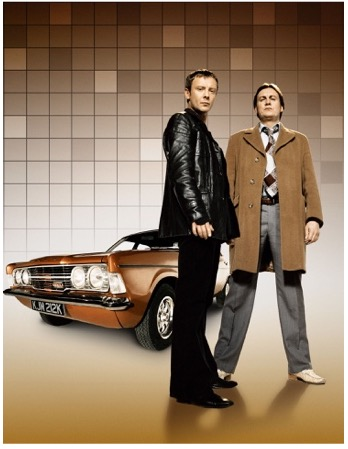

Amidst a new era of crime dramas and sci-fi, Netflix re-released a 2006 series which really does seem like a lifetime away from the world we live in today. This extraordinary take on crime drama had me hooked from start to finish with its archaic characters and iconic soundtrack, transporting you from modern day to the somewhat estranged life of 1973. 

 

The show is made up of 2 series with hour long episodes, which I felt, allowed me to become really attached to the storyline and the characters. Being a crime drama, while also having paranormal elements and humour, was such an interesting combination, that I was immediately intrigued. 

 

**What’s it about?**

The series is initially set in 2006, where Sam Tyler (John Simm), Detective Chief Inspector within the Greater Manchester Police force, is dealing with a case when he finds himself in a car accident. However, when Sam awakes, he seems to have been taken back to 1973.

 

*‘’My name is Sam Tyler. I had an accident and woke up in 1973. Am I mad, in a coma or back in time? Whatever’s happened, it’s like I’ve landed on a different planet. Now maybe if I can work out the reason, I can get home.’’*

 

Over the course of two series, Sam finds himself tackling not only cases that impact 1973 but also influence his own childhood and the future. Each episode proposes a new case that Sam and the team must solve, for him to return to his home in 2006. 

Having arrived from a more modern version of the police force, Sam must overcome the challenges that the lawless 1973 officers provide him, whilst also protecting his secret that he is here from the future. 

Sam constantly battles with his new unorthodox, rough around the edges DCI, Gene Hunt (Philip Glenister), but the development in their friendship adds to the series. 

 

Screen writers Matthew Graham and Ashley Pharoah have cleverly juxtaposed the two different eras throughout the series by their embodiment of the times within the characters. While Sam respects the rules of modern day and its sensitivities, Gene and the rest of the CID often use their gut instincts and force to coerce confessions from the suspects, followed by the catchy phrase “you’re nicked!”. There is no denying that despite “The Gov’s” brutality, there is an underlying sense of right and wrong, where their purpose is to serve and protect the neighbourhood; the quaint idea of ‘goodies’ against the ‘baddies’. 

 

It is truly the characters who make this series come to life; with their quirks, loyalty and Gene’s undeniable chauvinism and patriarchal heroism, causing the audience to form an attachment to these loveable rogues. As the series progresses, it is not hard to see why Sam Tyler began to feel that he was really LIVING in 1973, while 2006 is portrayed as rather drab without Gene and his Ford Cortina. 

**Then and now...**

 

The series, although entirely captivating is not without its questionable content; especially as the majority of the setting is based in 1973. We are greeted by multiple racial slurs, sexist stereotypes and brutality (for instance surrounding the football), which was not far from the less jolly version of 1973 that is depicted in the show. In particular, the existence of Sam Tyler’s love interest, Annie (Liz White), and treatment of the suspects, calls into question some pretty complex topics concerning feminism and racial equality. 

I found this particularly thought provoking as I watched Sam deal with these issues, instructing Gene on how to behave after his initial shock to the brashness of the times. Despite the characters being endearing, it shocked me how 15 years ago, characters who were so boldly racist and homophobic could be so integral to the plot.  

 

The complexity of the issues so deeply rooted in the men of the GMP (Greater Manchester police force), is conveyed as so blasé that you could be deceived into thinking life in 1973 was much simpler. Especially as the excitement, trauma and heartbreak of the episodes is all forgotten with the resolve that everything can be solved by a drink at the local pub in the evening. 

**What did I think?** 

As a whole, the series was thoroughly enjoyable! Luckily for me, the story continues in the more recent sequel Ashes to Ashes.  The way that the show was made allows you to follow Sam’s journey directly; both coming to terms with his new reality and the fact that the real world is moving on around him. 

 

For me, the ending of the show was especially emotional. Not to give away spoilers, but after the length of time that Sam spends in 1973 and the friendships that he develops, I empathised with his confusion. The dream world that is created in the show is so vibrant and enigmatic that even just as an audience watching, I wanted to remain with Gene, Annie and follow Sam’s journey further. 

 

As sung by David Bowie In the final scenes of the show; ‘’wonder if he’ll ever know, he’s in the bestselling show, is there life on mars?”. These words resonate with me, and that is the beauty of life on mars; that I still have questions and interpretations. But also a sense of solidarity at the prospect of this magical life beyond death—something id like to believe in. 

 

I am giving Life on Mars a score of 8.7/10.