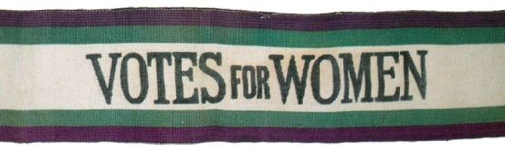

In a world full of bold statements, new messages and concepts, the influence of text and what it symbolises has never been more prominent than in this time of change and acceptance. From the suffragette's banner to LGBTQ+ support posters, in the last decade we have seen how the use of typography can help communities in their cause as well as instill belief and hope in others. 

I have always had a passion for films, novels, brands etc, who have a strong sense of female empowerment. Whether I am watching my favourite marvel heroines, or reading the story of a highly complex female character such as in 'Gone Girl', I have so much admiration for the courage that they possess. 

I decided that my blog would contain the running theme of women behind the scenes of typography; therefore incorporating my interests and the topical theme of today: feminism. Throughout this blog i will be exploring the way that text conveys ideas such as female repression, beauty, inclusivity and so on-- with the underlying theme of femininity. A picture (or in this case; typography), really does say a thousand words. 

## My Logo